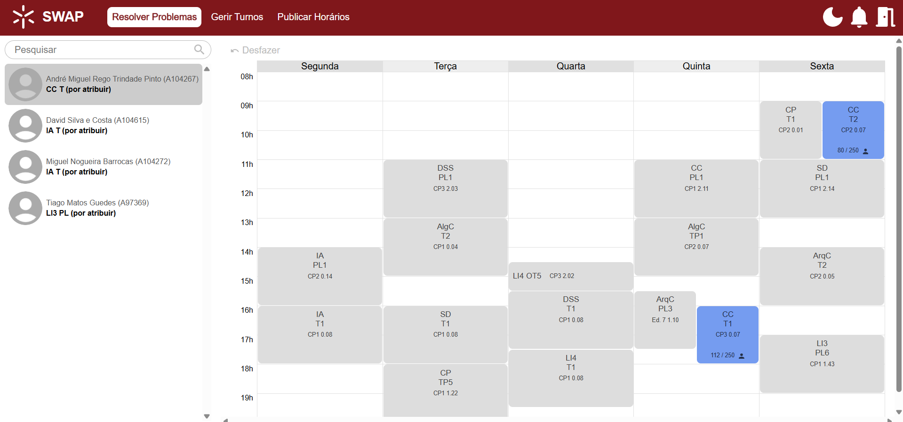

# IPM

User interface for managing schedules in a university course. UMinho's Human-Computer Interaction
2024/25 assignment. See [Assignment.pdf](Assignment.pdf) for more details.

Grade : 19 / 20 :star:



## Authors

 - Ana Oliveira (A104437)
 - Humberto Gomes (A104348)
 - Inês Marques (A104263)
 - Rafael Vilas Boas (A76350)
 - Sara Lopes (A104179)

## Compilation

To install all required dependencies, run:

```console
$ npm install
```

Then, you can run a development server with automatic code reloading the following way:

```console
$ npm run dev
```

For a production-ready build, run:

```console
$ npm run build
```

## Linting and formatting

The project can be linted and formatted with the following commands, respectively:

```console
$ npm run lint
$ npm run format
```
